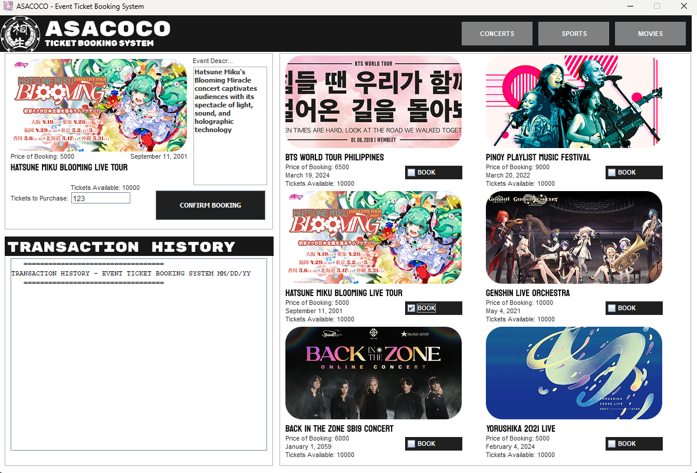

# Event Ticket Booking System
## 2025 03 05

### Description:
This is a coding project I made for my 1st year in Computer Science. If you wish to copy
the code, then by all means. 

### Code Functionality:

* Users can select an event (Concert, Movie, Sports)
* Choose the number of tickets
* Get a bookingsummary
* Uses JCheckBox for event selection
* JTextArea for transaction logs
* JOptionPane to confirm bookings
* The user should enter the number of tickets using JTextField.

### What You Could Do To Make It Better:

* Add Icons for the JCheckBoxes
* Change the Array Structure where column indices have all the details for one event

